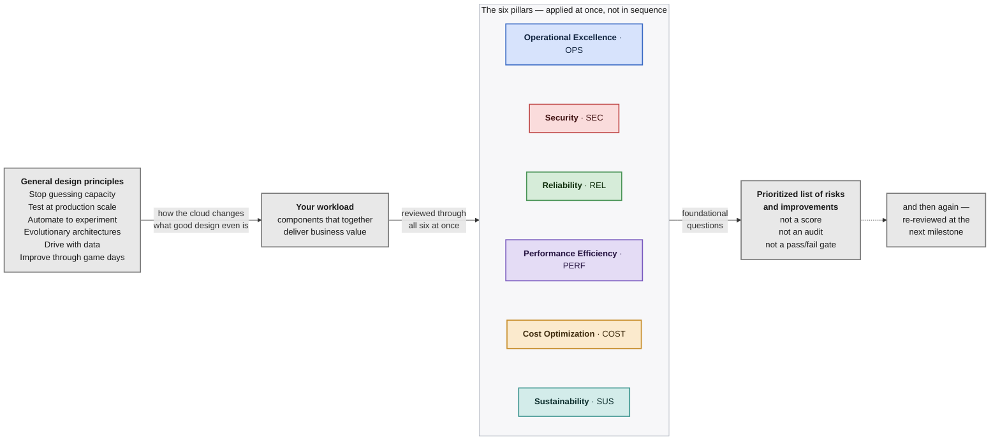
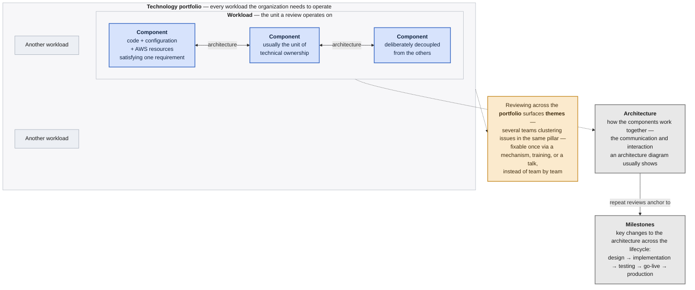
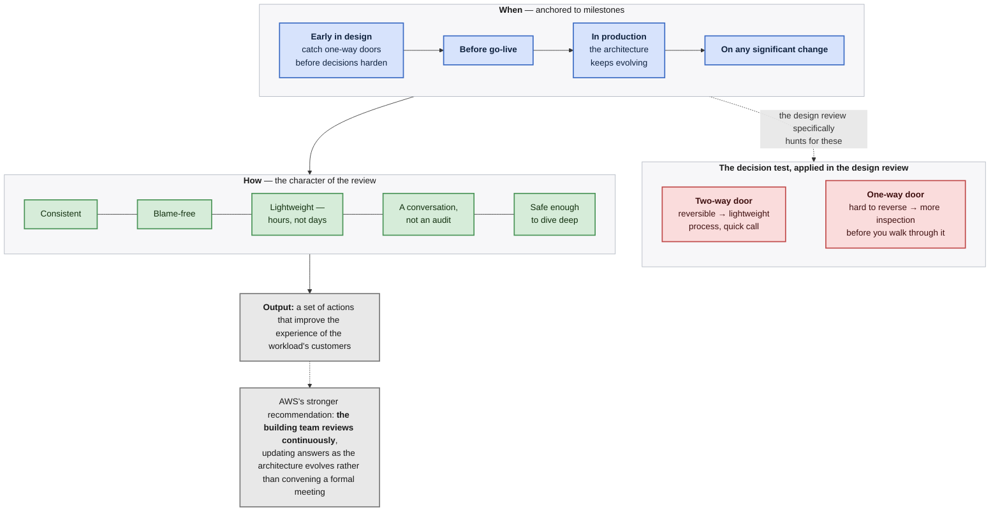
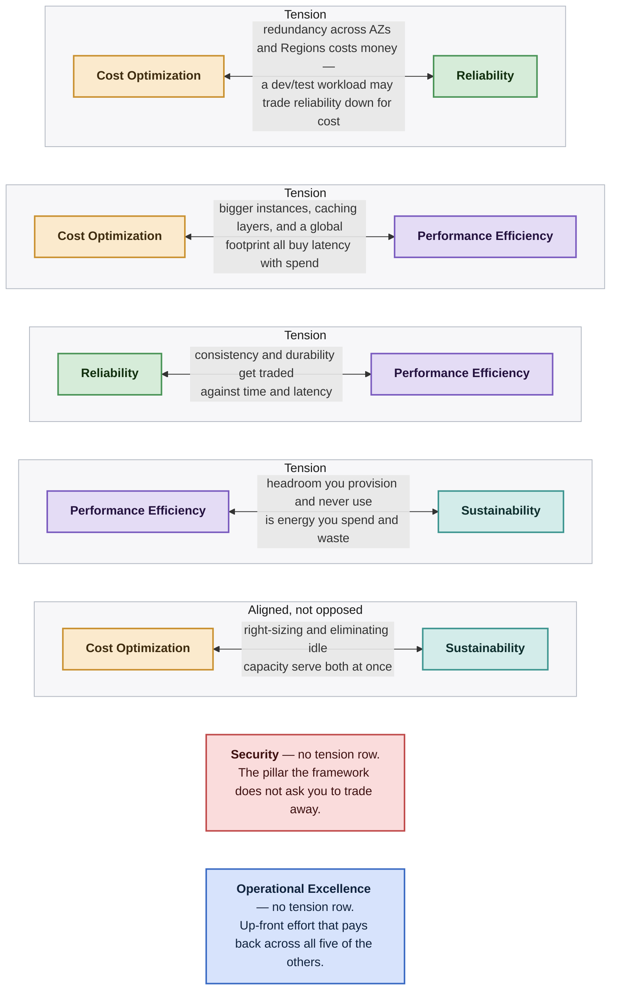
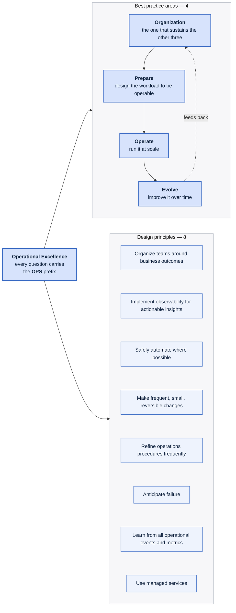
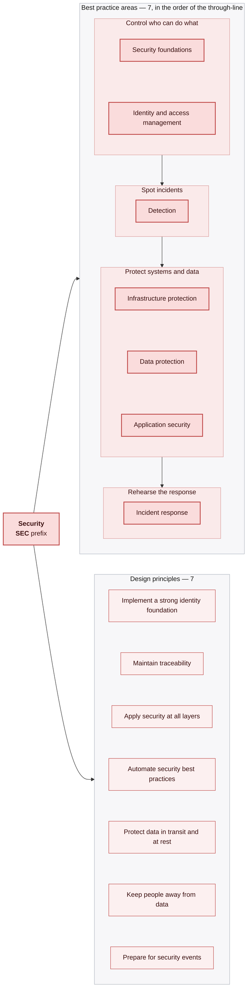
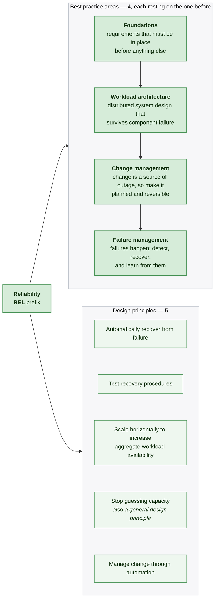
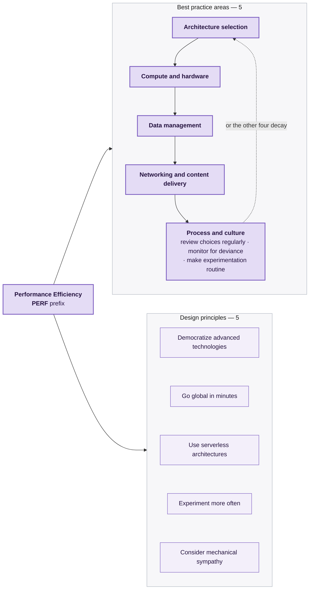
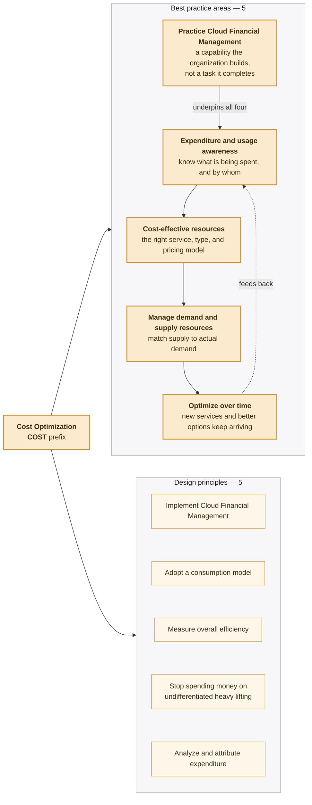
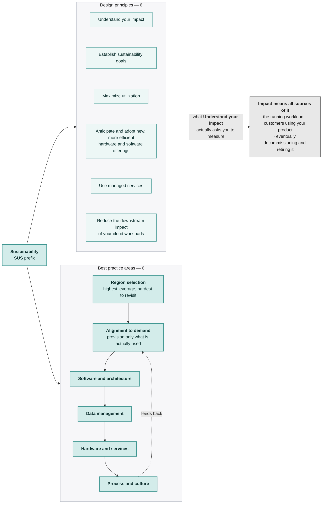

# AWS Well-Architected Framework — diagrams

Ten diagrams covering the framework's structure: what it is, the vocabulary it
depends on, how a review runs, where the pillars pull against each other, and
one map per pillar.

These are for building the mental model. The recall drilling lives in
[`flashcards.md`](flashcards.md), and the one-page print reference is
[`cheatsheet.html`](cheatsheet.html) — all three are drawn from the same source
and don't disagree.

Diagrams are Mermaid, which Obsidian renders natively (as do GitHub and VS Code
with a Mermaid preview extension). Grounded in the AWS Well-Architected
Framework docs, publication date November 6, 2024. Unofficial; not affiliated
with or endorsed by AWS.

---

## 1. The framework at a glance

The mistake this fixes: the six pillars are **six simultaneous lenses on one
workload**, not six phases you move through. You don't finish Security and
advance to Reliability. Every pillar is asked about the same workload at the
same time, and the general design principles sit above all six.

Note where the arrow ends. A review's output is a prioritized list of risks and
improvements — never a score, never a pass/fail, never a certification.

---

## 2. The vocabulary, and how it nests

These words get used loosely in conversation and precisely in the framework. The
nesting is the whole point: a **component** is the smallest thing the framework
talks about owning, a **workload** is what a review operates on, and a
**technology portfolio** is what you review when you want themes rather than
findings.

Why the workload is the review unit: it is the level of detail business and
technology leaders naturally talk about — small enough to reason about
concretely, large enough that the answers matter outside the engineering team.

---

## 3. The review process

Three things to hold onto: **when** reviews happen, **what kind of process** a
review is, and the fact that AWS's real recommendation is stronger than
periodic reviews — the team that built the architecture reviews it continuously
as it evolves, updating answers rather than convening a meeting.

The design-phase review has a specific job: catching **one-way doors** while
they are still open.

---

## 4. Where the pillars pull against each other

Trade-offs are the part a flat list of six pillars hides. Each row below is one
real tension, resolved against business context rather than by rule. The last
row is the pair that mostly **aligns** instead of competing.

Two pillars sit outside the rows on purpose. **Security** is the one the
framework doesn't ask you to trade away, even when you're trading reliability
down for cost in a dev environment. **Operational Excellence** is up-front
effort that pays back across all five of the others rather than competing with
any of them.

---

## 5. Operational Excellence — OPS

**Covers:** a commitment to build software correctly while consistently
delivering a good customer experience — organizing the team, designing the
workload to be operable, running it at scale, and improving it over time.

The four best practice areas form a loop, and **Organization** is deliberately
first: it's the one that sustains the others. The same ordering shows up in the
design principles, where organizing teams around business outcomes is listed
ahead of every technical principle.

---

## 6. Security — SEC

**Covers:** using cloud technologies to protect data, systems, and assets, and
to improve your security posture.

Seven best practice areas is the most of any pillar, and they're easier to hold
as the through-line the framework gives them: control **who can do what**, spot
incidents, protect systems, keep data confidential and intact, and have a
**rehearsed** response.

---

## 7. Reliability — REL

**Covers:** the ability of a workload to perform its intended function correctly
and consistently when it is expected to — including being able to operate and
test it across its whole lifecycle.

The four areas stack: you can't manage change safely without a sound workload
architecture, and you can't manage failure without both. **Stop guessing
capacity** appears here as well as in the general design principles — one of the
few genuine repeats in the framework.

---

## 8. Performance Efficiency — PERF

**Covers:** using cloud resources efficiently to meet performance requirements,
*and* holding that efficiency as demand changes and technologies evolve.

The second half of that definition is the harder half, and it's why **Process
and culture** is drawn as the loop back to the start rather than as a fifth item
in a list: efficiency achieved once and never revisited decays.

---

## 9. Cost Optimization — COST

**Covers:** running systems that deliver business value at the lowest price
point.

The shape here is a capability underneath and a loop on top. **Practice Cloud
Financial Management** is framed as an organizational capability you build, not
a task you complete — which is why it sits under the other areas rather than
beside them — and **Optimize over time** feeds back into the cycle, because new
services and better pricing options keep arriving.

---

## 10. Sustainability — SUS

**Covers:** continually reducing the environmental impact of running cloud
workloads — primarily energy consumption and efficiency — by getting maximum
benefit from what you provision and minimizing what you need at all.

Two things worth noticing. **Region selection** comes first because it's the
highest-leverage decision and the hardest to revisit. And the impact you're
asked to measure is broader than the running workload: it includes customers
using your product, and eventually decommissioning it.

---

## Where to go next

- [`flashcards.md`](flashcards.md) — 112 cards across the same seven domains, for recall drilling
- [`cheatsheet.html`](cheatsheet.html) — the one-page printable version of all of the above
- [`../aws/`](../aws) — SAA-C03, covering the services these answers get built from
